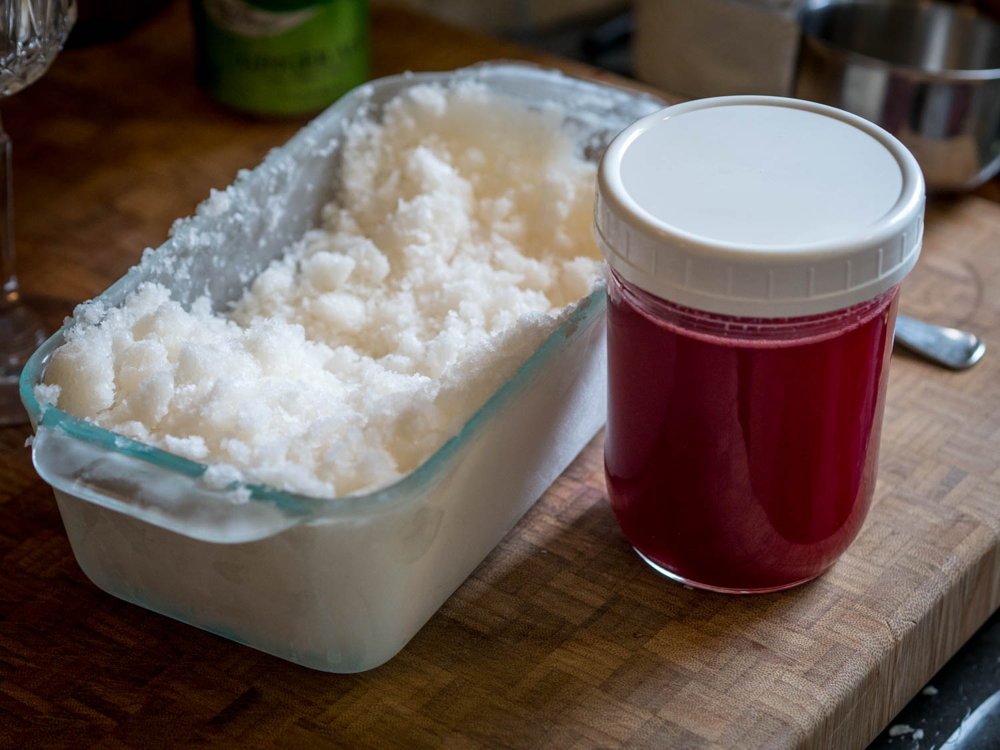
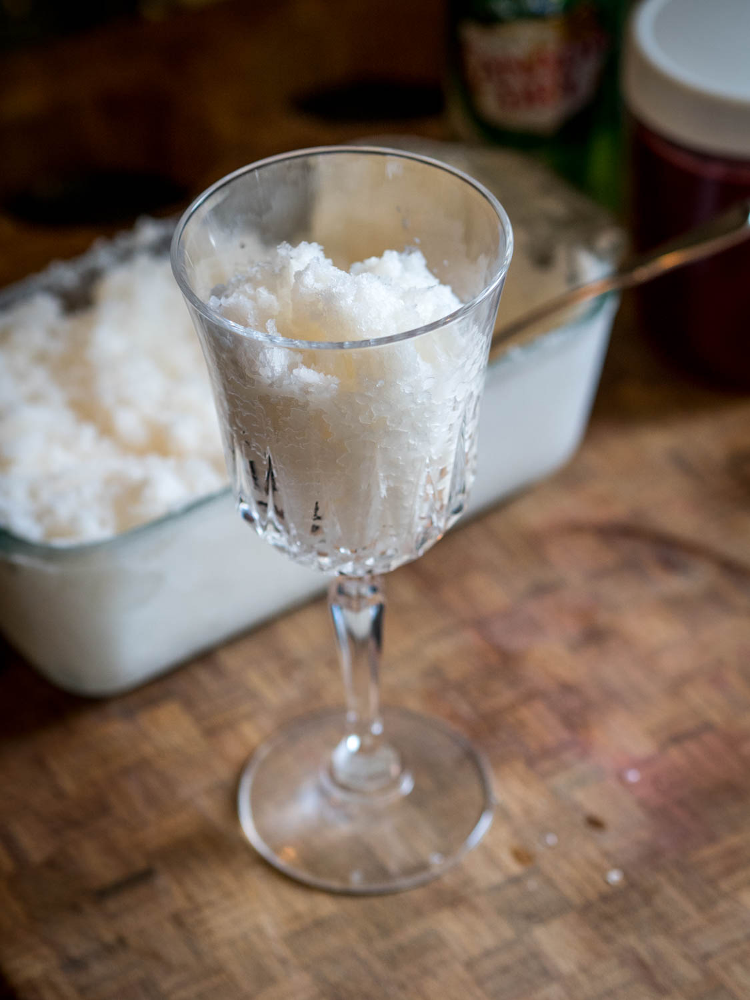
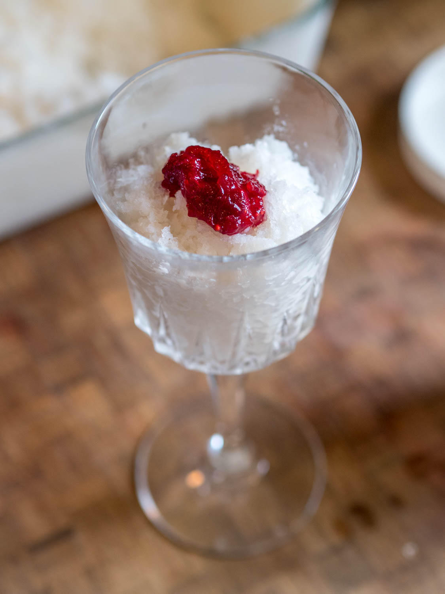
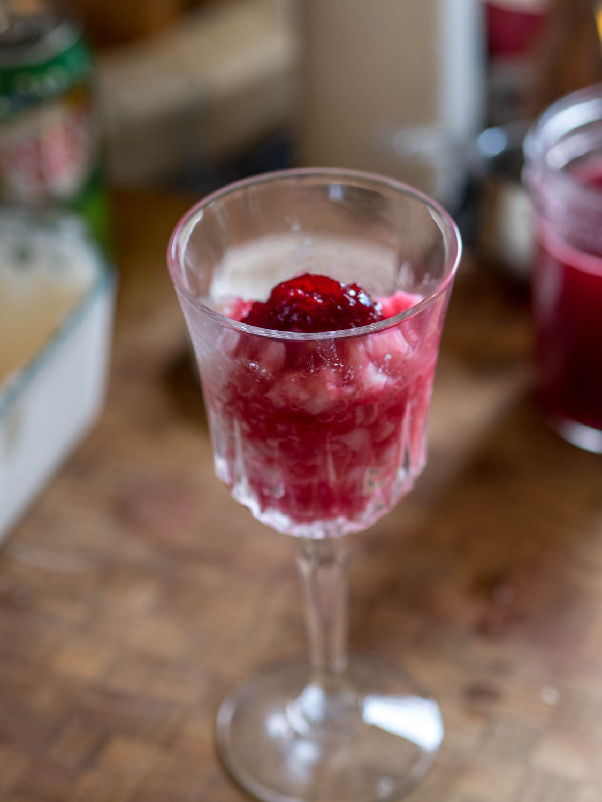
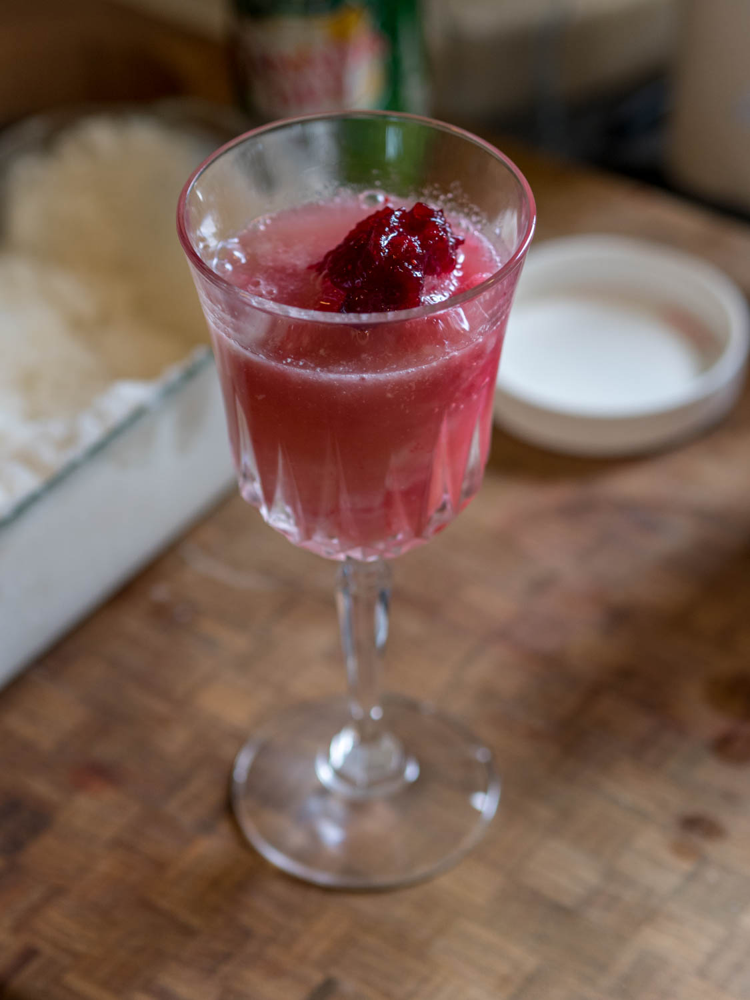

[Maangchi taught me out to make makgeolli](https://www.maangchi.com/recipe/makgeolli). It came out really good, so I decided to experiment. One experiment was to turn it into granita. That involves freezing it while stirring every twenty minutes or so to break up the ice crystals.

[David Lebovitz taught me how to make cranberry shrub](http://www.davidlebovitz.com/cranberry-shrub-and-cranberry-shrub-cocktail-recipe/). I wind up making it pretty often because you wind up with shrub and cranberry sauce. JD has the sauce, I have the shrub.

-----

**Maddy made makgeolli.**

**Maddy also made cranberry shrub.**

**Maddy got too excited and mixed them together.**

**Everything's prettier in a cut-glass goblet.**

**Pretty it up with a dollop of sauce.**

**Pink pink pink pink pink.**

**Adding the shrub makes the granita melt a bit, but that's okay. Stay strong.**

**It's not ginger ale, it's sky ale. You only drink it while flying.**

**Unless you're Maddy. Maddy loves the stuff.**

**Top up with ginger ale and add a splash of lime.**

**Cranberry plus vinegar plus rice wine kinda punch one in the face. Ginger ale makes a good mediator, and lime is just the comedian in the room.**

-----

### Ingredients

---|---
1 cup | makgeolli granita all fluffed up
maybe a tbsp | homemade cranberry sauce (a byproduct of making the shrub)
2 tbsp | cranberry shrub
idk like a cup | ginger ale
splish | lime juice. Like a quarter lime's worth
{: class="ingredients" }

### Method

1. Make the makgeolli granita the night before. Pour a quart or so into a Pyrex dish and drop it in the freezer. Stir it every twenty minutes or so, breaking up any clumps and mixing the ice crystals back into the solution.
2. Get a little fed up with work the next day and decide to make a drink.
3. Scoop some granita into a glass --- fanciest one you can find.
4. Carefully spoon some cranberry sauce on top.
5. Carefully spoon some shrub onto the granita until it starts to get pink all the way to the bottom of the glass.
6. Top up with your sky ale, and splish your lime juice on the top. You should windup with a slushy, fizzy mixture with a sweet cranberry dollop on top.
