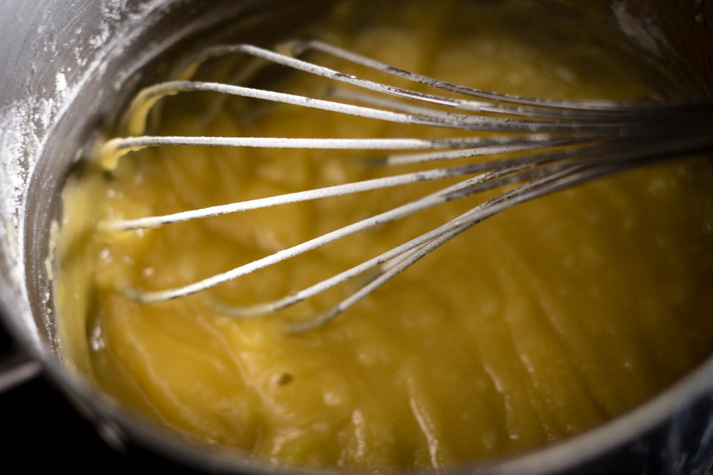
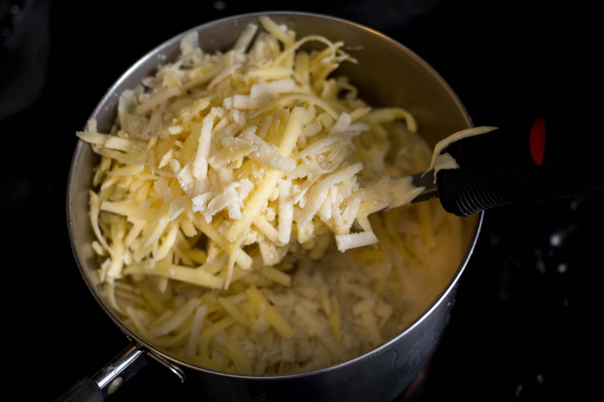
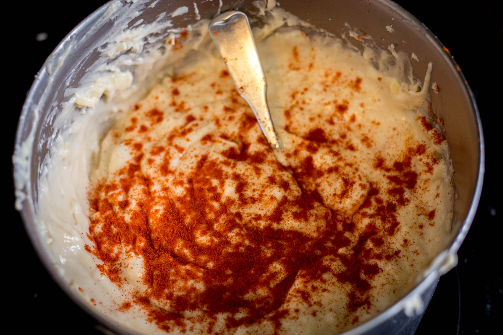
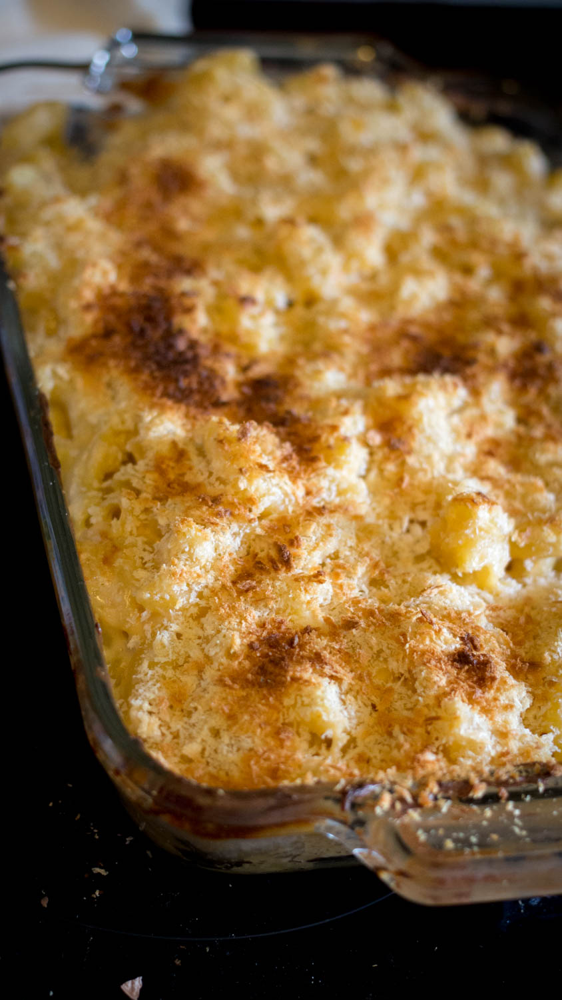

    *the music coordinator has given up, the music is Disney tune covers. The voiceover is hollering* <strong>MEALTIME WITH MADDY</strong>

**Dairy builds strong bones.**

**Butter is just delicious.**

**know what else is delicious?**

**Garlic.**

**Fuck up your garlic finely.**

**You'll also need some flour**

**Melt you some butter, heck it up with your garlic, then heck that up with your flour. Bit by bit.**

**Keep stirring that hecker. It'll start smelling grand.**

**I didn't take a picture of it because I'm awful, but heat your milk over medium high, just until it starts bubbling but not boiling.**

**It's called scalding, and it's neat.**

**Have your lovely-assistant-cum-husband shred some cheese.**

**Half cup of parmesan, cup and a half of aged cheddar.**

**Shreddar, if you will.**

**Wow.**

**What's this?**

**A magical transformation. Keep stirring until your butter/flour/garlic starts to turn golden.**

**It's a roux, and it's good for thickening stuff.**

**Introduce your milk to your roux once it's gotten all sexy. Do it a third at a time, though.**

**It'll suck at the beginning, but keep powering through.**

**It'll get super thick, so don't use a whisk like Maddy. She fucked up.**

**Keep on adding milk and stirring until that mess gets all delicious and stuff and you use up the milk.**

**It should be thick and silky and creamy.**

**Like me.**

**Not really.**

**Keep it on heat if it isn't, it'll thicken over time.**

**Is your cheese shredded?**

**Has husbandog done his duty?**

**Beautiful, isn't it.**

**Over medium heat, stirr your cheese into your béchamel.**

**Oh yeah. Your roux plus milk is called béchamel sauce. It's a mother sauce. It has beautiful children.**

**Beautiful, cheesy children.**

**Stir in some paprika.**

**You can add other shit, too, like peas, or broccoli, or cumin. De gustibus, etc.**

**You're a grown up.**

**You can do what you want.**

**You boiled a bag of noodles, right**

**Right**

**Good, now stir your sauce into them.**

**You could eat this now, but you're a champ. You can soldier on.**

**Sprinkle on some panko, toss that ish in the oven at 400&deg;F.**

**You preheated the oven, right**

**Right**

**Brown under the broiler, if you like a bit of browning on your m&c.**

**My doctor told me to cut down on this shit because of cholesterol, but I was hungry.**

**Heck it up with sriracha, if you're so inclined.**

-----

### Gear

* two small saucepans, at least a quart each
* a big pan, at least five quarts
* a baking dish, probably 9"x13"
* a whisk
* a cheese grater
* an oven preheated to 400&deg;F

### Ingredients

---|---
3 cups | milk
&frac12; cup | butter
&frac12; cup | AP flour
many | cloves of garlic *(optional, but if you skip, please consider your life choices)*
cheese | cheese: You want about three cups, yeah? Think maybe two and a half of a melty cheese, like sharp cheddar, and a half cup of a sharp cheese like parmesan, peccorino, or romano
a bit of | paprika (*optional*)
some | panko --- enough to cover your dish
1&frac12; lb bag | large elbow pasta (if you can only find 1 lb bags, use only two thirds of your cheesy sauce; the rest will keep well in the fridge)
extra | toppings or fillings, at your discretion. Peas? Caramelized onions? Diced serranos? A can of hatch green chilis? A whole lot of nothing? The sky's the limit, and you're an adult. You choose.
{: class="ingredients" }

### Method
1. Over medium-high heat, scald your milk: heat slowly, stirring frequently, until starts to bubble but not quite boil, then remove from heat.
2. In your other pan, melt your butter over medium-high heat and add your minced garlic.
3. Slowly incorporate the flour into your melted butter, stirring constantly. The mixture will thicken.
4. Keep stirring your butter/flour mixture --- a roux --- over the heat. It will slowly start to darken in color. Once it reaches a peanut-butter colored brown, remove it from the heat.
5. Start your noodles to boiling.
6. Add your milk, one third at a time, to the roux, stirring constantly. It's gonna suck for a bit: the mixture will get super thick. Use a spoon to start, then switch to a whisk as the mixture gets thinner.
7. Continue stirring your béchamel over medium heat until it gets silky and any graininess has disappeared. It shouldn't be thin; if it is, keep heating. It'll be thick enough when you can dip a spoon in, drag your finger across the back of the spoon, and the sauce won't re-cover the stripe.
8. Mix your cheese into the béchamel, stir until it melts, but no further. Remove from the heat.
9. When your noodles are done, drain and stir in your cheese sauce.
10. Transfer your noodles to your dish --- it probably won't all fit, but the rest will keep in the fridge.
11. Top with panko and toss into your oven for ten or fifteen minutes. If you like your topping browned, turn on the broiler for the last two minutes or so, but keep an eye on it so you don't burn it.

*Serves idk 5 or 6.*
