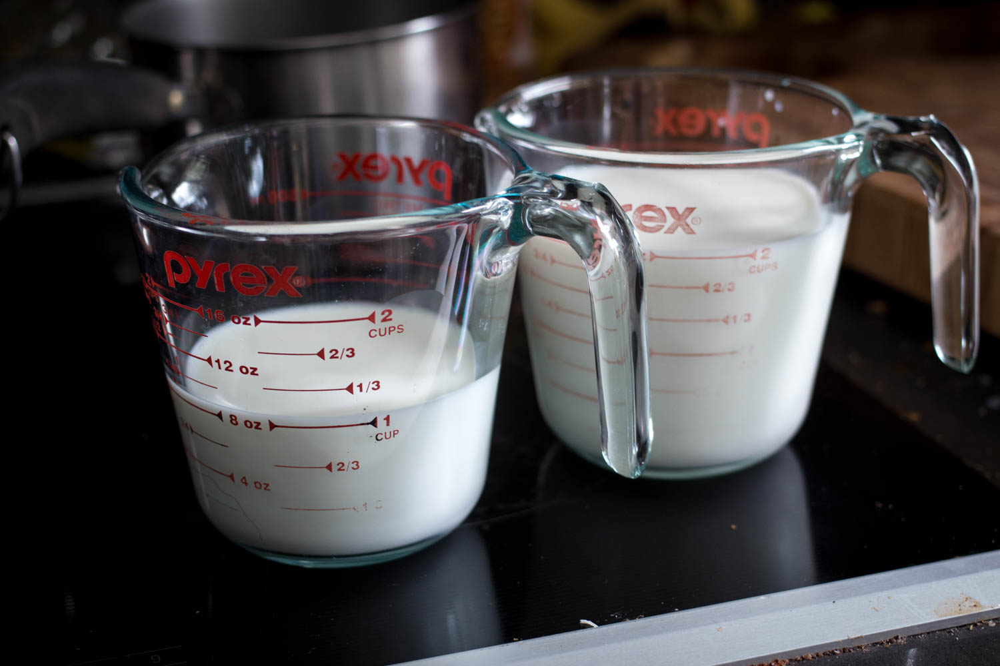
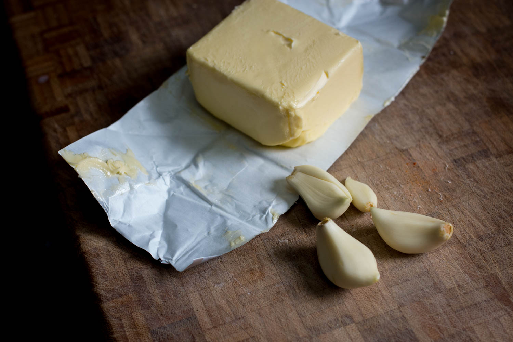
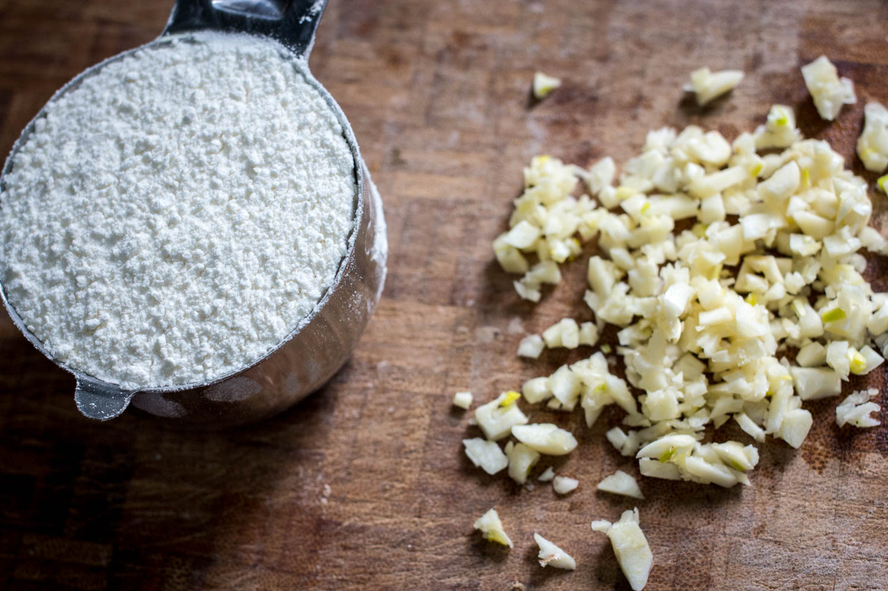
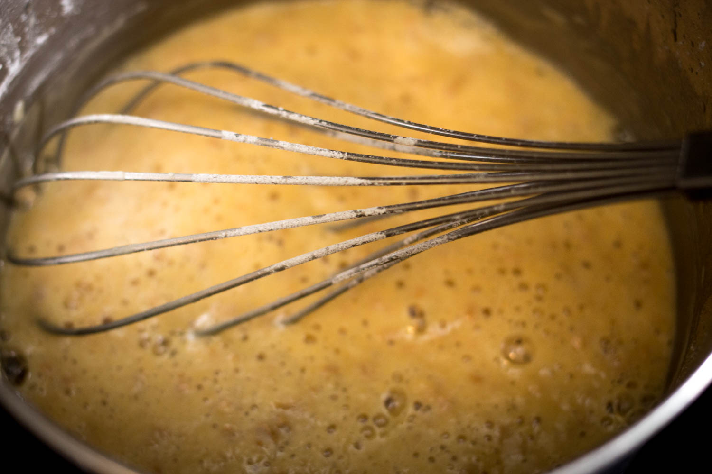
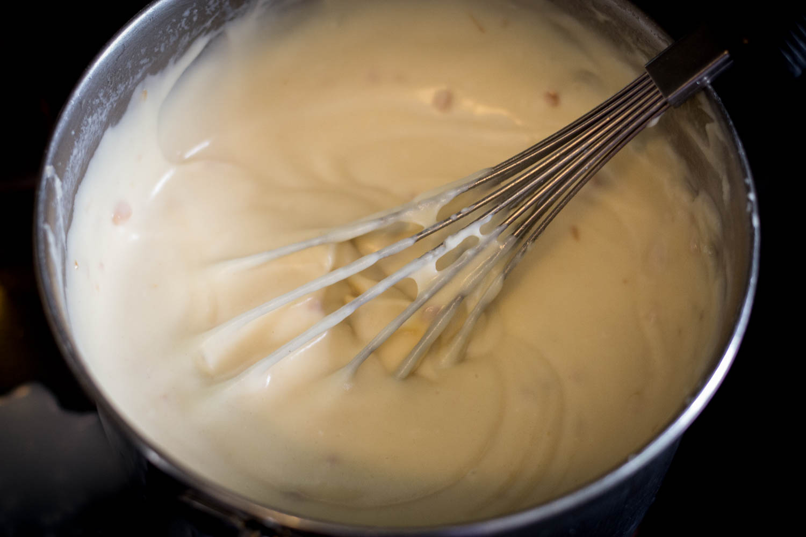
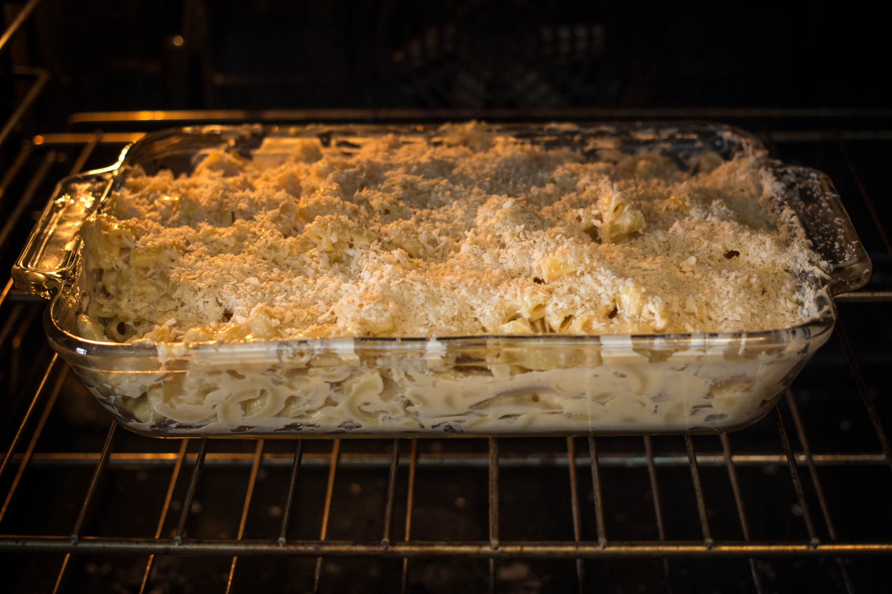

    *the music coordinator has given up, the music is Disney tune covers. The voiceover is hollering* <strong>MEALTIME WITH MADDY</strong>

**Dairy builds strong bones.**

**Butter is just delicious.**

**know what else is delicious?**

**Garlic.**

**Fuck up your garlic finely.**

**You'll also need some flour**

**Melt you some butter, heck it up with your garlic, then heck that up with your flour. Bit by bit.**

**Keep stirring that hecker. It'll start smelling grand.**

**I didn't take a picture of it because I'm awful, but heat your milk over medium high, just until it starts bubbling but not boiling.**

**It's called scalding, and it's neat.**

**Have your lovely-assistant-cum-husband shred some cheese.**

**Half cup of parmesan, cup and a half of aged cheddar.**

**Shreddar, if you will.**

**Wow.**

**What's this?**

**A magical transformation. Keep stirring until your butter/flour/garlic starts to turn golden.**

**It's a roux, and it's good for thickening stuff.**

**Introduce your milk to your roux once it's gotten all sexy. Do it a third at a time, though.**

**It'll suck at the beginning, but keep powering through.**

**It'll get super thick, so don't use a whisk like Maddy. She fucked up.**

**Keep on adding milk and stirring until that mess gets all delicious and stuff and you use up the milk.**

**It should be thick and silky and creamy.**

**Like me.**

**Not really.**

**Keep it on heat if it isn't, it'll thicken over time.**

**Is your cheese shredded?**

**Has husbandog done his duty?**

**Beautiful, isn't it.**

**Over medium heat, stirr your cheese into your béchamel.**

**Oh yeah. Your roux plus milk is called béchamel sauce. It's a mother sauce. It has beautiful children.**

**Beautiful, cheesy children.**

**Stir in some paprika.**

**You can add other shit, too, like peas, or broccoli, or cumin. De gustibus, etc.**

**You're a grown up.**

**You can do what you want.**

**You boiled a bag of noodles, right**

**Right**

**Good, now stir your sauce into them.**

**You could eat this now, but you're a champ. You can soldier on.**

**Sprinkle on some panko, toss that ish in the oven at 400&deg;F.**

**You preheated the oven, right**

**Right**

**Brown under the broiler, if you like a bit of browning on your m&c.**

**My doctor told me to cut down on this shit because of cholesterol, but I was hungry.**

**Heck it up with sriracha, if you're so inclined.**

-----

### Ingredients

---|---
3 cups | milk
&frac12; cup | nice, unsalted butter
&frac12; cup | flour
&frac12; cup | shredded parmesan or other hard cheese
1&frac12; cup | shredded sharp cheddar
plenty | minced garlic
a good bit of | paprika
1&frac12; lb bag | noodles (if you can only find 1 lb bags, just use ⅔ the sauce)
enough | panko
maybe some | additions
{: class="ingredients" }

### Method

1. In a big pot, cook your noodles to *al dente*.
2. In one pot, scald your milk over medium-high heat. That'll be just as it starts bubbling, but not boiling. Stir to keep it from burning on the bottom. Remove from heat.
3. In another pot at the same time, melt the butter with the minced garlic. Stir in your flour and keep stirring over medium heat. The color will darken over time --- once you hit peanut butter color, you can move on to...
4. Slowly incorporate the milk into the roux one cup at a time. It'll suck at first, but keep going, it'll smooth out.
5. Stir your béchamel over medium-high heat until it thickens. It should be thick enough that, when you dip a spoon in, you can draw your finger through the sauce on the back of the spoon and it won't fill it back in. You may not even need to thicken further from step 4.
6. Stir your cheese and paprika into the béchamel bit by bit, then stir your noodles in to your sauce. if you're adding anything, now's the time.
7. Pour your mac into an oven dish, top with panko, and put in a preheated-to-400&deg;F oven for idk like 20 minutes.
8. Brown the panko under a broiler for a minute or two, then serve.
