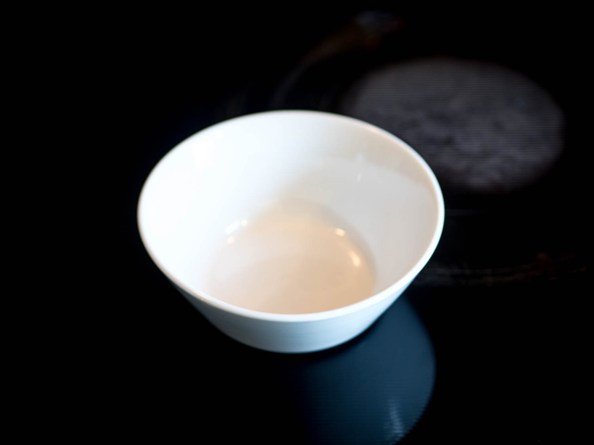

Tamago Kake Gohan is for mornings when your stomach is feeling a little rough. Or any other morning, but also those. If you leave out the spicy bits, it's nice and gentle.

Feel free to go nuts with it, though. You're all grown up.

-----

**Maddy's feeling a touch rough today.**

**Y'all got rice cookers, you can ignore this bit and also go to hell because I don't.**

**Three parts rice, four parts water. 1&frac12; cups rice, 2 cups water.**

**Start bringing it to a boil.**

**Gonna chop some veg, because I love the taste of its mangled corpse.**

**Cleaver: Maximum Metal.**

**Once your rice comes to a boil, stir immediately, cover, and immediately turn down to the lowest setting.**

**Okay google.**

**Set a timer for fifteen minutes, and stop tracking my every move.**

**Gotta blanch our veg. Boil some water and pour it on.**

**This'll brighten the color and keep the onions from being too strong.**

**Bowl.**

**Egg.**

**Soy.**

**Veg, and also guest star Gochujang. Cameo by hot chili oil.**

**Weep as you gently bully your sauce until it has complicated feelings about gender later in life.**

**Sorry. I'm all mixed up here.**

**Beep beep, motherfucker. Rice is done.**

**Bully it too.**

**Now you're sobbing, wondering if you're really trans, or if it was just trauma.**

**Sorry.**

**Sorry.**

**Dry your eyes. You're queer as hell and loving it.**

**Mix some steaming hot rice into your sauce. The heat will cook it.**

**You're finally coming into your own as a trans woman.**

**And you made tamago kake gohan.**

\*sniffle\* **Sorry that got real, I'm a bit emotional today.**

-----

### Ingredients

---|---
1&frac12; cups | short-grain rice
2 cups | water
1 | egg
idk like a tbsp | soy sauce
some | veg
maybe also some | spice. Gochujang, sriracha, chili oil, sesame seeds, etc.
{: class="ingredients" }

### Method

1. Make your rice. Bring the rice and water to a boil in a pot. Once it boils, *immediate* turn the heat down to the lowest setting on your stove. Give it a stir, and cover. Cook for fifteen minutes.
2. Chop up some veg. It'd be a good idea to blanch it, too: pour boiling water over it and let it sit for about thirty seconds before draining.
3. Combine your egg, soy, veg, and spice in a bowl. Beat them up.
4. Once your rice is done, beat that up, too, then re-cover and remove from heat. Let it sit for two minutes.
5. Stir hot rice into your egg/soy sauce. The heat from the rice will cook the egg. Add rice as you need until it's not too salty. Add soy if it needs more salt.
